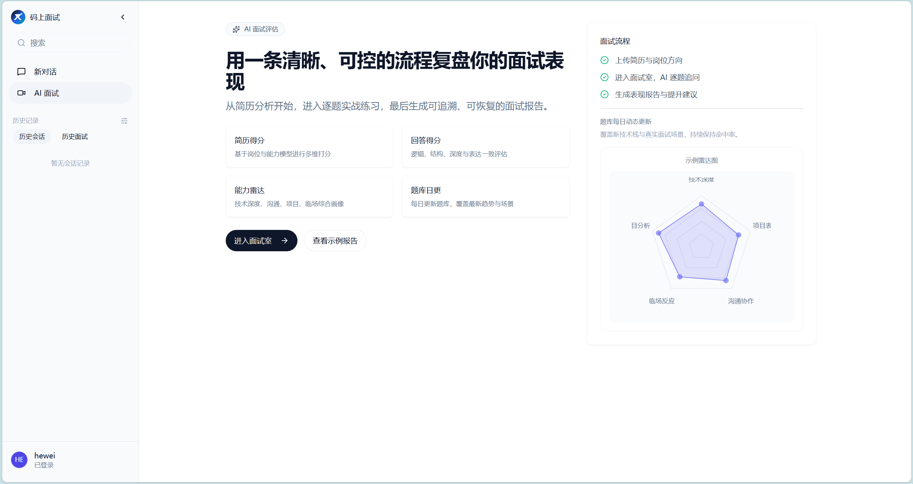
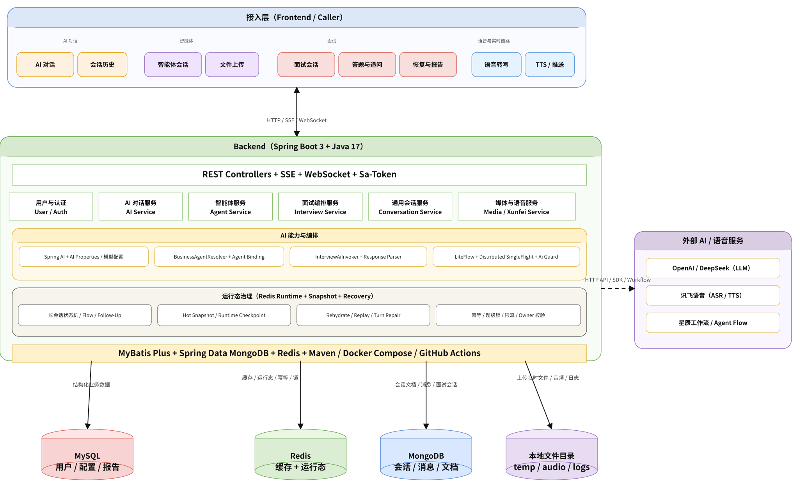
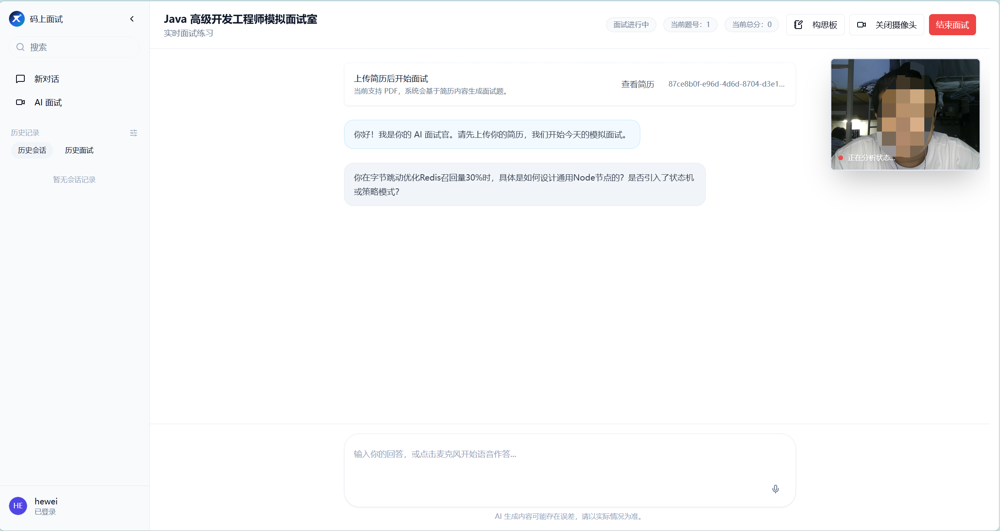
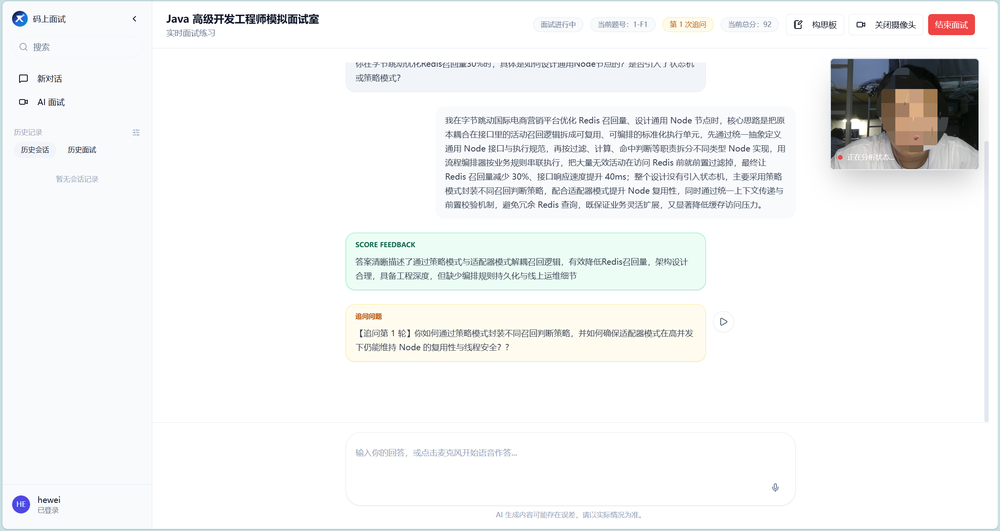
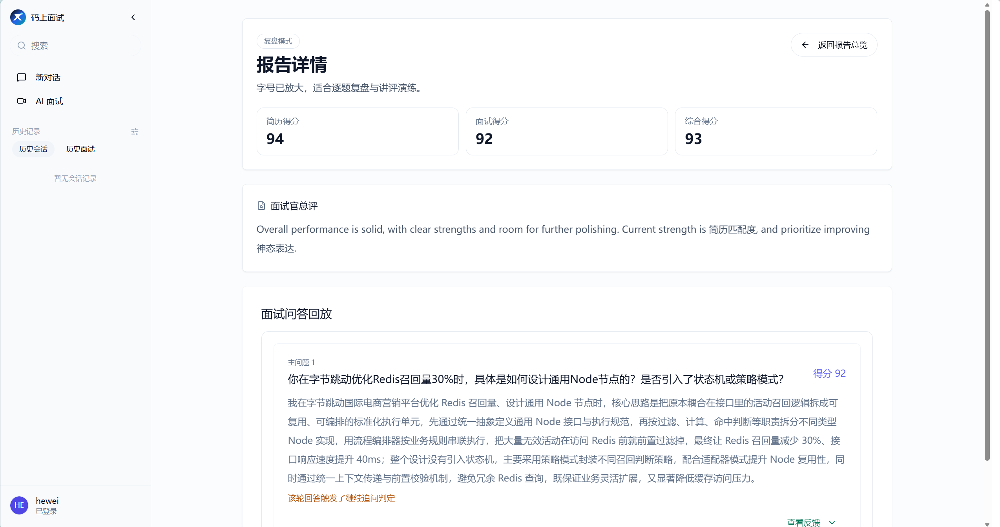

# AI Meeting

基于大语言模型的 AI 智能面试与对话平台后端，围绕“简历分析 → 智能出题 → 多轮面试 → 答案评分 → 结果复盘”构建，同时支持 AI 对话、智能体工作流、实时语音转写和语音合成。

> 本仓库主要包含后端服务，前端项目需要单独部署。

## 项目预览





## 核心功能

- 简历 PDF 上传、解析与结构化信息提取
- 根据简历生成个性化面试题
- 多轮问答、智能追问与面试流程管理
- AI 答案评分、面试建议和多维能力雷达图
- 面试记录、逐题回放和结果复盘
- AI 对话与 Agent 流式输出
- 基于 SSE 的流式响应
- 基于 WebSocket 的实时语音识别
- 讯飞长文本语音合成
- 用户登录、Token 认证和角色权限控制
- Redis 分布式锁、限流、缓存与 AI 请求去重
- MongoDB 会话快照，支持长会话恢复

## 系统架构

```text
前端 ── HTTP / SSE / WebSocket ──> Spring Boot 后端
                                      ├── MySQL：用户、权限、业务配置
                                      ├── MongoDB：对话、面试记录、会话快照
                                      ├── Redis：缓存、锁、限流、会话状态
                                      └── AI / 讯飞：模型、语音识别、语音合成
```



## 技术栈

| 技术 | 用途 |
| --- | --- |
| Java 17 | 开发语言 |
| Spring Boot 3.4.4 | 应用框架 |
| Spring AI 1.0.0 | AI 模型统一接入 |
| MyBatis-Plus | MySQL 数据访问 |
| MySQL 8.x | 用户、权限和业务配置 |
| MongoDB 7.x | 对话、面试数据和运行态快照 |
| Redis 7.x / Redisson | 缓存、分布式锁、限流和会话状态 |
| LiteFlow | 面试追问规则编排 |
| Sa-Token | 登录认证与权限控制 |
| SSE / WebSocket | 流式对话与实时音频通信 |
| Maven 3.6.3+ | 项目构建 |
| Docker Compose | 服务部署 |

## 环境要求

- JDK 17 或更高版本
- Maven 3.6.3 或更高版本（也可以使用项目自带的 Maven Wrapper）
- Docker Desktop 或 Docker Engine + Docker Compose
- 可用的 AI 模型接口
- 使用语音功能时需要讯飞开放平台凭证

## 快速启动

### Docker Compose

项目会自动启动 MySQL、MongoDB、Redis 和后端服务：

```bash
docker compose up -d --build
```

后端默认地址：`http://localhost:8002`  
健康检查地址：`http://localhost:8002/actuator/health`

查看状态和停止服务：

```bash
docker compose ps
docker compose down
```

### 本地启动后端

先启动 MySQL、MongoDB 和 Redis，再执行：

```bash
./mvnw -pl admin spring-boot:run
```

Windows PowerShell：

```powershell
.\mvnw.cmd -pl admin spring-boot:run
```

## 配置说明

复制环境变量模板并按实际环境修改：

```powershell
Copy-Item .env.example .env
```

常用变量：

| 环境变量 | 默认值 | 说明 |
| --- | --- | --- |
| `SERVER_PORT` | `8002` | 后端端口 |
| `MYSQL_HOST` / `MYSQL_PORT` | `127.0.0.1` / `3306` | MySQL 地址和端口 |
| `MYSQL_DATABASE` | `mainshi_agent` | MySQL 数据库名 |
| `MYSQL_USERNAME` / `MYSQL_PASSWORD` | `root` / `123456` | MySQL 账号密码 |
| `MONGODB_HOST` / `MONGODB_PORT` | `127.0.0.1` / `27017` | MongoDB 地址和端口 |
| `MONGODB_DATABASE` | `xunzhi_agent` | MongoDB 数据库名 |
| `REDIS_HOST` / `REDIS_PORT` | `127.0.0.1` / `6379` | Redis 地址和端口 |
| `SPRING_AI_OPENAI_API_KEY` | - | AI 模型 API Key |
| `SPRING_AI_OPENAI_BASE_URL` | - | OpenAI 兼容接口地址 |
| `SPRING_AI_OPENAI_MODEL` | - | 对话模型名称 |
| `XUNFEI_APP_ID` / `XUNFEI_API_KEY` / `XUNFEI_API_SECRET` | - | 讯飞服务凭证 |

请勿把真实 API Key、数据库密码或其他敏感信息提交到 Git 仓库。生产环境应通过 Secret 或环境变量注入配置，并及时更换已经暴露过的凭证。

## 数据库初始化

MySQL 初始化脚本位于 `admin/src/main/resources/sql/`。首次使用 Docker Compose 创建 MySQL 数据卷时会自动执行。修改 SQL 后，已有数据卷不会自动重新执行；开发环境可重新创建数据卷，生产环境请使用数据库迁移方案。

## 测试与构建

```bash
./mvnw -B -ntp clean verify
docker build -t ai-meeting-backend:latest .
```

Windows：

```powershell
.\mvnw.cmd -B -ntp clean verify
```

## 目录结构

```text
AI-Meeting/
├── admin/                         # Spring Boot 后端模块
│   ├── src/main/java/             # 业务代码
│   ├── src/main/resources/        # 配置、SQL 和工作流定义
│   └── src/test/                  # 测试代码
├── docs/assets/                   # 项目截图和架构图
├── mcp/skill-guard/               # Skill Guard MCP 工具
├── skills/                        # 项目领域知识与开发规范
├── docker-compose.yml             # 基础设施和后端编排
├── Dockerfile                     # 后端镜像构建文件
├── pom.xml                        # Maven 父工程配置
└── .env.example                   # 环境变量示例
```

## 前端项目

前端需要单独运行并配置后端地址。原前端仓库：

<https://github.com/lishuangqiang/AI-Meeting-Frontend>

如果你已迁移前端，请将上面的地址替换为自己的前端仓库。

## 项目截图






## 开源协议

本项目遵循 [MIT License](LICENSE)。使用、修改和再发布前，请阅读许可证以及第三方服务和资源的相关条款。贡献规范请参考 [CONTRIBUTING.md](CONTRIBUTING.md)。
