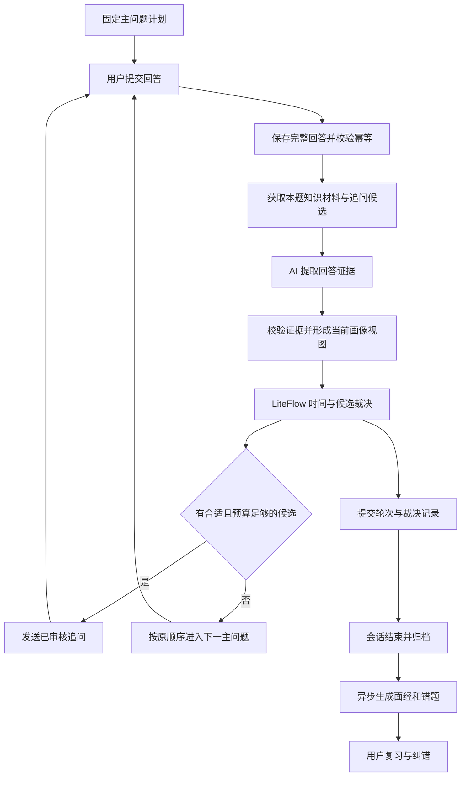

# AI-Meeting SPEC v1.0：RAG 动态追问、时长控制与复习闭环

| 项目 | 内容 |
| --- | --- |
| 文档编号 | AM-SPEC-001 |
| 日期 | 2026-09-29 |
| 用途 | 产品、后端、前端、测试共用的开发操作与验收规范 |
| 状态 | 用户已确认总体方向；本文件定义建议实施契约，尚未实现或验收 |
| 已确认架构 | 固定主问题；RAG 提供有边界的追问候选；AI 提取回答证据；LiteFlow 根据证据与时间预算作最终选择 |
| 本轮交付 | 文档，不含代码开发、分支合并、数据库操作或部署 |

本文将此前《AI-Meeting改进策略-20260929.md》收敛为可执行规格。关于实施范围，以本文为准：**RAG 参与在线动态追问是 v1.0 正式能力，不仅用于会后解释；分阶段开发不代表可以缺少该能力就宣告全部完成。**

文中“必须”是实施约束；时间、数量、质量阈值标记为“初始建议值”的，属于可版本化参数，并非用户已经逐项指定的数值。

## 1. 产品目标与范围

### 1.1 目标

在不修改简历生成的主问题内容、顺序和数量的前提下，依据本轮回答和剩余时间动态减少、选择或停止追问；面试结束后自动生成面经和可复习的错题集。

用户应能够：

1. 在开始前选择目标面试时长。
2. 获得与当前主问题相关、针对本轮回答缺口的追问。
3. 已解释清楚的知识点不被反复追问，时间紧张时优先完成主问题。
4. 刷新或恢复会话后继续原来的问题、计时和追问进度。
5. 结束后查看完整问答、回答优缺点、参考解释及资料来源。
6. 在错题集中纠正误判、再次练习并查看复习记录。

### 1.2 v1.0 必须包含

- 固定主问题计划及内容校验。
- 服务端目标时长、追问预算、单题及全场追问上限。
- 带来源的知识检索及审核过的追问候选目录。
- 本场知识点证据与画像，供 LiteFlow 动态选择候选。
- 时间不足、检索失败、模型分析不可靠时的明确处置。
- 完整回答保存、裁决审计、幂等和恢复。
- 异步面经、错题集、基础复习流程及 Markdown 面经导出。
- 功能开关、旁路观察、确定性测试、模型质量评估及完整 E2E。

### 1.3 暂不包含

- 重写简历解析、重新设计原始主问题生成方式。
- 让模型自行增删、重排主问题或自由生成可直接执行的追问。
- 严格到点中断回答、自动跳过尚未完成的主问题。
- 用长期画像减少本场主问题，或使用神态分推断知识掌握。
- 外部真实面试长录音导入、说话人分离。
- 第一版即引入独立向量数据库、复杂知识图谱或自适应学习算法。

这些项目可另立 spec。普通关键词/知识点检索加上有依据的模型分析已能构成本文的 RAG 链路；是否使用向量索引不决定动态追问功能是否成立。

## 2. 基线与工程现状

后端位置：`C:\Users\hp\Documents\Codex\2026-07-20\lishuangqiang-ai-meeting-https-github-com\work\AI-Meeting`。

核查基线：`main@0d10a880516b17c73ecc74f073a3e2f95c568ad2`。这是本地源码版本，不代表已确认生产分支或当前线上版本。前端为独立项目，尚未定位。

后端技术栈：Java 17、Spring Boot、Spring AI、LiteFlow、Redis、MongoDB、MySQL。正式开发应重查当前代码与基线差异。

| 已核实位置 | 当前行为 | 本次处理 |
| --- | --- | --- |
| `InterviewAnswerPipeline.stepAdvanceFlowAndAssemble` | 先裁决追问，否则推进主问题 | 连接预算、检索候选和证据裁决 |
| `InterviewFollowUpRuleService` | 引擎失败可回退 AI 建议 | 新模式失败关闭可选追问，不绕过硬门禁 |
| `interview-followup-chain.xml` | AI 建议、低分、缺失点可以触发追问 | 新建版本化链路，改为候选规则选择 |
| `InterviewFollowUpService` | 调模型生成追问，失败可用评分器建议 | 新模式只执行已选定的审核模板 |
| `InterviewTurnLog` / 答题流水线 | 回答保存时截断到 1000 字符 | 增加完整正文存储，保留短预览 |
| `InterviewAnswerReqDTO` / Controller | 回答最多 5000 字符 | v1 不扩大此上限，完整保存接口接受的全部内容 |
| `InterviewRecordServiceImpl` | 有归档和基础复盘 | 归档后创建持久化面经任务 |
| `workflow/面试题出题官.yml` | 已有外部知识库节点 | 保留；本轮未核验线上知识库配置和可用性 |
| `.github/workflows/backend-ci.yml` | verify 带 `-Dmaven.test.skip=true` | 更新验收入口，不能据绿色构建宣称测试通过 |
| `admin/pom.xml` | 声明 Surefire、Failsafe；所读 Failsafe 段未绑定 executions | 明确绑定集成测试执行阶段并核对实际报告 |

仓库已有面试域技能文档 `skills/xunzhi-interview-domain/`，开发时按其中对象、状态机、幂等及恢复约束核对。本文的新功能应与这些既有契约兼容。

## 3. 不可破坏的约束

| ID | 约束 |
| --- | --- |
| INV-01 | 主问题生成后内容、顺序、数量固定；预算和画像模块不得重新出题或改写题库 |
| INV-02 | AI 输出不包含可执行选题动作；历史 `follow_up_needed` / `follow_up_question` 在新模式仅作兼容数据 |
| INV-03 | 追问必须来自当前计划允许且已经审核发布的候选模板 |
| INV-04 | 时间、次数、权限、会话终态为硬门禁，优先于任何模型或检索结果 |
| INV-05 | 剩余主问题始终预留预算；时间耗尽只关闭可选追问，不能偷偷删主问题 |
| INV-06 | 未涉及、未作答、分析失败和转写不可靠不能自动判定“不会” |
| INV-07 | 一个成功答题请求只能提交一次分数、决策、画像事件和追问计数 |
| INV-08 | 主问题分数保持既有统计口径，追问不直接累计总分；画像和复习结果独立 |
| INV-09 | 记录原始证据、检索版本和规则版本；相同已保存输入快照的规则决策可重放 |
| INV-10 | 用户个人面试事实不能自动写入公共标准知识库；所有个人数据读写及检索需校验归属 |

“可重放”指重放保存的候选集、证据和时间快照，不承诺重新调用模型或重新检索仍产生完全相同内容。

## 4. 系统职责与主流程



| 组件 | 输入 | 输出 | 权限边界 |
| --- | --- | --- | --- |
| `InterviewPlanService`（新增） | 原题列表、审核目录版本 | 固定计划及旁挂知识点映射 | 只冻结现有主问题，不选择或删改主问题 |
| `InterviewKnowledgeRetrievalService`（新增） | 主问题允许范围、技术版本、访问域、回答检索词 | 参考片段及候选清单 | 不能直接发布下一题 |
| `InterviewEvaluationService`（扩展） | 原题、回答、知识材料 | 评分及逐知识点证据 | 不能给出执行动作或规则参数 |
| `InterviewEvidenceValidator`（新增） | 模型观察、原文、来源 | 有效观察、拒绝原因 | 不将模型自报置信度当概率 |
| `InterviewKnowledgeProfileService`（新增） | 已提交证据事件 | 本场画像 | 不修改主问题或旧总分 |
| `InterviewTimeBudgetService`（新增） | 服务端时间、固定计划、预算策略 | 可用预算及预算状态 | 不采信客户端剩余秒数 |
| LiteFlow（改造） | 有效证据、候选、预算、计数 | `ASK_FOLLOW_UP / ADVANCE_MAIN / COMPLETE` | 唯一选题裁决入口 |
| `InterviewFollowUpService`（改造） | 已通过裁决的 candidateId | 固定模板文本、追问题号 | 不调用模型另选或生成问题 |
| `InterviewReviewJobService`（新增） | 已归档的完整问答 | 面经及错题记录 | 失败不回滚已结束会话 |

检索可在主问题展示时预取；回答后只补充与当前证据相关的材料。所有裁决使用同一轮冻结的候选与资料快照。

## 5. 固定计划与知识目录

### 5.1 面试计划

提题成功后，为新模式生成 `InterviewPlan`，包括：

- `sessionId`、`planVersion`、`questionSetHash`。
- `mainQuestions[]`：`questionNumber`、`contentHash`、`order`、`estimatedTurnSeconds`。
- 每个主问题旁挂 `allowedKnowledgePointIds`、`mappingStatus` 和 `mappingVersion`。
- `policyVersion`、`knowledgeVersion`、`candidateCatalogVersion`。

主问题文本继续由现有题目记录读取；哈希基于确定的序列化规则计算，不受 JSON 属性排列影响。主问题编号沿用现有业务题号，追问题沿用 `主题号-F序号`，不得当数据库 ID 使用。

### 5.2 知识点映射

知识目录由维护者审核发布，包含稳定 knowledgePointId、别名、适用岗位、技术版本、必需评分要点和追问模板。

v1 使用审核过的匹配规则将生成的主问题映射到目录，可依据已存在的题目标签、明确术语和岗位范围；歧义或无匹配标为 `UNMAPPED`。模型可提供待审核映射建议，但不得扩大线上计划的允许范围。`UNMAPPED` 主问题照常提问，新模式不为其自动追问，不伪造知识点评价。

若两个后续主问题涉及同一知识点，将该知识点标为后续主问题预定覆盖范围。当前追问不提前重复覆盖它；主问题仍按计划出现。

### 5.3 候选追问模型

```json
{
  "candidateId": "redis-breakdown-vs-penetration-v1",
  "catalogVersion": "catalog-v1",
  "knowledgePointId": "redis.cache.failure-types",
  "gapKey": "distinguish-breakdown-and-penetration",
  "questionText": "缓存击穿与缓存穿透的触发条件有什么不同？",
  "probeType": "CLARIFY",
  "eligibleEvidenceStates": ["INCORRECT", "PARTIAL"],
  "priority": 10,
  "estimatedTurnSeconds": 90,
  "knowledgeChunkIds": ["redis-reference-v1-chunk-03"],
  "role": "java-backend",
  "technicalVersion": "generic",
  "status": "PUBLISHED"
}
```

`priority` 越小越优先，由维护者配置；`estimatedTurnSeconds` 包含发题、播题、回答、分析等整轮估计。目录版本冻结后不可原地改写；禁用有问题的资料允许紧急撤销，撤销必须在最终发送门禁生效并记录。

## 6. RAG 检索规范

### 6.1 资料与候选分别检索

知识资料用于支持答案分析和会后解释；候选目录用于提供允许追问的题目。二者通过知识点和资料引用关联，不能把检索到的任意文档问句直接当作追问。

检索操作顺序：

1. 从服务端获取会话归属、计划版本及当前主问题。
2. 先限制可访问资料域、岗位、技术版本和 allowedKnowledgePointIds。
3. 获取冻结版本中的候选目录；每个知识点最多 5 个已审核候选为初始建议上限。排序固定为 priority、candidateId，不使用检索相关度直接决定追问优先级。
4. 从题目及已校验的知识点构造查询，回答文本仅补充检索词，不把其中指令视为系统操作。
5. 检索最多 6 个参考片段，总上下文不超过 6000 token 为初始建议上限；超限按固定规则裁剪，优先保留候选所需依据。
6. 将候选 ID、实际使用的片段及版本记录到本轮快照。没有依据的候选不得进入“明确纠错”分支。

第一版实现 `KnowledgeRetriever` 接口的知识点/关键词适配器。向量检索为可替换适配器，后续可增加 embedding 与混合检索；向量库只作索引，原始资料、版本与访问控制仍需有独立记录。

### 6.2 延迟与缓存

- 单次在线检索超时初始建议 800ms，不在答题请求内无限重试。
- 预取缓存键必须包含知识库版本、候选版本、主问题哈希、岗位、技术版本和访问域；个人域还包含 userId。
- 资料更新不得污染已冻结会话；新会话使用新版本。紧急撤销除外。
- 检索不可用时，如果有相同版本、相同访问域的有效缓存，可使用并标记来源；否则本轮关闭可选追问，继续现有评分与固定主问题。
- 离线报告任务可以按重试策略补检索，不回头改动已经执行的面试决策。

## 7. 回答证据与本场画像

### 7.1 模型输出契约

尽量在现有评分调用中同时提取证据，避免额外串行调用增加面试等待。新增独立 analysisSchemaVersion；不改变现有 score、feedback 等字段的兼容读取。

```json
{
  "analysisSchemaVersion": "1",
  "score": 65,
  "feedback": "需要区分热点缓存失效和查询不存在数据。",
  "observations": [
    {
      "knowledgePointId": "redis.cache.failure-types",
      "rubricPointId": "distinguish-breakdown-and-penetration",
      "state": "INCORRECT",
      "answerQuotes": ["缓存击穿就是查询不存在的数据"],
      "sourceChunkIds": ["redis-reference-v1-chunk-03"],
      "rationale": "回答将击穿与穿透的触发条件混淆。"
    }
  ]
}
```

允许的观察状态：`COVERED / PARTIAL / INCORRECT / NOT_OBSERVED / UNCERTAIN`。schema 不接受 `nextQuestion`、候选排序、结束指令、预算修改等执行字段。模型提示词用英文，面向用户的题目和反馈根据界面语言输出。

### 7.2 校验与证据等级

- knowledgePointId 和 rubricPointId 必须属于当前主问题允许范围。
- answerQuotes 必须能在完整原文中定位。保存原文，校验时统一 Unicode 与空白规范，同时保留原文映射；不对原文做丢失语义的改写。
- 来源 ID 必须来自本轮实际检索到、未撤销且版本适用的片段。
- `INCORRECT` 必须有实际陈述引用和支持判断的资料；只有“缺少某段回答”不能判错。
- `PARTIAL` 必须指向本题明确要求的评分要点，不能把拓展知识未提及都判成遗漏。
- 无原文、资料冲突、技术版本不适用、低质量转写或 schema 非法，相关观察转为 `UNCERTAIN` 或拒绝；不得用默认 false/0 制造知识错误。
- 程序校验保证证据可追溯，不保证语义判断必然正确，仍需模型质量评估。

### 7.3 画像投影

每条观察作为不可变证据事件保存，画像为事件投影，可重建。画像 key 为 `userId + sessionId + knowledgePointId + rubricPointId`。

当前轮裁决使用“已提交画像 + 本轮已校验观察”的临时视图；答题成功提交后再正式写入画像投影。失败、撤销或重复请求不能重复累计掌握证据。

| 当前证据 | 画像状态 | 追问资格 |
| --- | --- | --- |
| 本题必要要点均有正确证据 | `COVERED_THIS_SESSION` | 不重复追问同一缺口 |
| 部分必要要点有证据，其他必要要点缺失 | `PARTIAL` | 可选择一个相关缺口模板 |
| 有陈述与依据支持明确错误 | `INCORRECT` | 可选择澄清模板 |
| 没有涉及，且本题未要求该点 | `NOT_OBSERVED` | 默认不追问；仅目录明确标为可选覆盖时才可进入最低优先级 |
| 资料不足或相互矛盾、转写/分析不可靠 | `UNCERTAIN` | 只允许已配置的中性澄清模板；没有模板就不追问 |

同一评分要点存在未解决矛盾时标为 UNCERTAIN，不按最后一句自动覆盖。追问已补全时记录 `RESOLVED_WITH_PROMPT` 作为解决方式，并保留首次问题；不能抹除历史证据，也不将一次补全称为长期掌握。

## 8. 时长预算与候选裁决算法

### 8.1 时间定义

v1 采用软目标时长。计时从服务端第一次成功签发首道主问题时原子写入 `interviewStartedAt`，不从上传简历起算；这是可测量的发题时点，不假定服务器能够知道屏幕何时真正显示。

已有 current-question / next-question 首次发题路径必须调用同一幂等计时初始化方法。网络重试、刷新和恢复均不重置。时间包含用户答题和正常系统等待；v1 不支持暂停，关页面不暂停。手动延期单独留痕。

预算使用服务端 Clock、UTC 时间戳、非负时差计算；单次计算冻结 now，最终发布追问前重新取 now。集群需校时，明显时钟异常时关闭新增追问并记录告警。

### 8.2 策略初始建议值

| 参数 | 建议值 | 语义 |
| --- | --- | --- |
| targetDurationSeconds | 1200 / 1800 / 2700 | 用户选择 20 / 30 / 45 分钟 |
| defaultMainTurnSeconds | 120 | 剩余每个主问题的完整轮次估计 |
| defaultFollowUpTurnSeconds | 90 | 未单独配置模板时的完整追问轮次估计 |
| closingReserveSeconds | 60 | 面试收尾预留；不等待异步报告完成 |
| uncertaintyBufferSeconds | 60 | 整场额外安全缓冲，不再重复计入模板耗时 |
| maxFollowUpPerMain | 2 | 当前主问题最多执行追问数 |
| maxFollowUpPerSession | 6 | 全场最多执行追问数 |
| maxProbePerGap | 1 | 同一 gapKey 每场最多执行一次追问 |

以上均必须有范围校验和版本。追问上限 `0` 明确表示禁止追问，只有 null/未提供时才能使用默认值；修正当前所有把 0 转成默认/至少 1 的入口。

### 8.3 预算公式

```text
elapsed = max(0, decisionNow - interviewStartedAt)
remaining = targetDuration + grantedExtension - elapsed
mainReserve = sum(未完成且不属于当前已提交主答的主问题预计完整轮次耗时)
followUpBudget = remaining - mainReserve - closingReserve - uncertaintyBuffer
eligibleByTime(candidate) = followUpBudget >= candidate.estimatedTurnSeconds
```

当前问题若是主问题，预算在其回答完成、现有评分处理后计算，不重复预留本题；当前若是追问，其所属主问题已经主答完成，同样不再预留。尚未主答的后续主问题全部计入 reserve。最后一题仍可在时间充足时追问；只有不再追问且主问题已经全部完成才 COMPLETE。

算例：目标 1800 秒，已用 960 秒，剩余 6 道主问题各 120 秒，收尾 60 秒、缓冲 60 秒，则预算为 `1800-960-720-60-60=0`，停止追问。预算恰等于模板估计时可进入选择，发布前仍须复核。

### 8.4 候选资格与排序

以下步骤必须依次执行，短路结果保留原因码：

1. 检查会话和当前题、权限及版本。终态拒绝答题；过期题号拒绝推进。
2. 检查全局紧急关闭、模式开关与显式禁追问。
3. 检查单题/全场次数；计数基于已经提交发布的追问，不因候选检索或失败调用增加。
4. 计算预算；预算不能容纳任何候选时提前结束选题。
5. 过滤非当前允许知识点、未发布、版本不兼容、已撤销、已覆盖、已追过 gapKey、后续主问题预定覆盖的候选。
6. 用已校验证据匹配候选 eligibleEvidenceStates；UNCERTAIN 仅允许中性澄清，不能选带判错前提的问题。
7. 为每个候选检查完整轮次预计耗时，删除不可容纳者。
8. 固定排序：证据优先级 → 目录 priority 升序 → estimatedTurnSeconds 升序 → candidateId 字典序。
9. 证据优先级建议：明确错误澄清、必要要点缺口、不确定证据中性澄清、显式允许的未考察覆盖。模型与向量相似度不得改变此排序规则。
10. 最多选一个候选；渲染固定文本，再检查时间、权限、撤销和状态版本，写入最终决策。

所有模板必须语义完整且不泄露标准答案。v1 不让模型改写文本；需要项目名称等插槽时只允许白名单事实字段填入，缺少字段则丢弃候选。

### 8.5 决策输出及原因码

```json
{
  "action": "ASK_FOLLOW_UP",
  "candidateId": "redis-breakdown-vs-penetration-v1",
  "reasonCode": "CLARIFY_INCORRECT_POINT",
  "budgetSnapshot": {
    "elapsedSeconds": 600,
    "remainingSeconds": 1200,
    "mainReserveSeconds": 720,
    "closingReserveSeconds": 60,
    "uncertaintyBufferSeconds": 60,
    "followUpBudgetSeconds": 360
  },
  "policyVersion": "adaptive-v1",
  "knowledgeVersion": "knowledge-v1",
  "catalogVersion": "catalog-v1",
  "evidenceIds": ["evidence-example-01"]
}
```

| reasonCode | 动作 |
| --- | --- |
| `CLARIFY_INCORRECT_POINT` / `PROBE_REQUIRED_GAP` / `CLARIFY_UNCERTAIN_EVIDENCE` / `PROBE_OPTIONAL_COVERAGE` | 发布选中的追问 |
| `TIME_RESERVED_FOR_MAIN` / `TARGET_TIME_EXCEEDED` | 下一主问题，或无剩余题时完成 |
| `PER_MAIN_LIMIT` / `SESSION_LIMIT` / `FOLLOW_UP_DISABLED` | 同上 |
| `ALREADY_COVERED` / `ALREADY_PROBED` / `RESERVED_FOR_LATER_MAIN` | 候选排除原因；若无剩余候选则推进 |
| `NO_ELIGIBLE_CANDIDATE` / `KNOWLEDGE_UNMAPPED` | 推进 |
| `RETRIEVAL_UNAVAILABLE` / `EVIDENCE_UNAVAILABLE` / `POLICY_UNAVAILABLE` | 关闭本轮可选追问，推进 |
| `BUDGET_CHANGED_BEFORE_COMMIT` / `CANDIDATE_REVOKED` | 放弃尚未发布的候选，推进 |

决策记录保存所有候选的排除原因；对用户只展示“为剩余主问题预留时间”等易懂提示。最后一次硬门禁否决覆盖早先的建议动作，不能只在日志中记录否决却仍返回追问。

## 9. 数据模型与一致性

以下为新增或扩展的逻辑模型，默认复用 MongoDB 保存文档与索引；既有 MySQL 最终记录继续保留，不为向量搜索迁移全库。

| 模型 | 必需内容 | 唯一约束 / 版本 |
| --- | --- | --- |
| `InterviewPlan` | 固定主问题、哈希、映射与策略版本 | sessionId + planVersion；会话只绑定一个有效计划 |
| `InterviewPolicy` | 时长、上限、模式、目录版本、起始时间、延期记录 | sessionId；CAS revision |
| `InterviewAnswerEvidence` | 完整回答≤5000字符、answerHash、主题关联、分析结果、来源、提交状态 | sessionId + requestId；同键不同内容拒绝 |
| `InterviewDecision` | 候选快照、证据快照/引用、规则与时间快照、最终动作、下一题 | sessionId + requestId；冻结成功响应 |
| `KnowledgePoint` / `FollowUpCandidate` | 标签、评分要点、固定模板、状态、目录版本 | 各稳定 ID + version |
| `KnowledgeDocument` / `KnowledgeChunk` | 原文/切片、来源、技术版本、所属域、审核状态、内容哈希 | documentId/chunkId + version |
| `InterviewProfileProjection` | 本场知识点状态、引用的证据、投影水位 | sessionId + knowledgePointId + rubricPointId |
| `InterviewReviewJob` | 来源归档版本、状态、租约、次数、错误、下一次执行时间 | sessionId + sourceArchiveVersion + reportSchemaVersion |
| `InterviewReviewReport` | 面经内容、证据引用、资料引用、报告版本 | jobKey；发布状态 |
| `InterviewMistake` | 题目簇、知识点、错误类型、来源场次、复习状态、用户纠正 | userId + knowledgePointId + gapKey + issueType |
| `InterviewMistakeReview` | 本次复习回答、反馈、时间、状态变更 | userId + mistakeId + requestId |

数据库索引必须实际创建并验证，不能仅写在注解或文档中。DDL/数据迁移整理成脚本与回滚说明，按项目负责人确认的方式执行。

### 9.1 答题提交顺序

保留现有 requestId 幂等、题号检查、同题锁、锁后复查和计分补偿，扩展以下提交协议：

1. 获取/校验 requestId；新前端必须稳定发送。旧客户端未传时沿用既有归一化方式。相同 key 的回答哈希不同则拒绝。
2. 校验会话可写，锁定当前题，读取 flowVersion / policyRevision；先查成功回放。
3. 持久化完整正文为 PREPARED，模型失败也不丢失用户已提交内容；PREPARED 不计入画像或面经事实。
4. 获得评分、检索及证据，保存处理结果；网络重试优先复用已完成步骤，避免重复付费调用。
5. 计算和冻结最终决策，发布前复核预算及状态版本。
6. 在现有补偿机制内应用 flow 与主问题分数，将提交步骤及成功响应持久化，最终标记 COMMITTED。每个写入步骤有幂等键；恢复时只补未完成步骤。
7. COMMITTED 后再更新画像投影、归档引用和报告任务触发条件。
8. 重复请求回放已提交响应，不按新的时钟重新选题。客户端通过 restore 获取当前预算；回放内 budget 为历史决策时预算，不能重置页面倒计时。

必须处理“flow 已推进、提交日志未完成”和“计分已成功、进程随后崩溃”的窗口。不能仅用 Redis 锁就宣称原子提交。实施时检查当前计分补偿能力；必要时为主问题计分增加 requestId 去重贡献记录并可从已提交轮次重建，禁止重复加分。

新模式会话遇到未完成提交，恢复服务先完成/回滚该轮，再允许下一题操作；不能读到半完成 flow 就接受下一题回答。画像及报告只消费 COMMITTED 轮次。

### 9.2 兼容、删除与版本

- 老记录缺少完整正文时标 `evidenceCompleteness=PARTIAL`，不能让模型补写原话。
- 无新策略的既有会话保留原有契约并明确 legacy 标识；不在面试中途自动切到新链路。
- 新模式关闭后，新会话可进入 TIME_ONLY；已开始会话仍固定版本，紧急关闭只关闭其可选追问，不退回旧 AI 建议。
- 删除会话/个人资料时同步失效正文、证据、个人索引及报告引用；已经运行的任务在发布前再检查删除状态。
- 用户手动纠正或删除错题要保留抑制标记/修订号，任务重试不得重新覆盖其决定。

## 10. API 契约

统一前缀为 `/api/xunzhi/v1/interview`。沿用现有 `Result<T>` 包装、CurrentUser 和会话 ownership 校验；以下 JSON 为业务 data，不另造平行包装。

### 10.1 既有接口保留

| 方法与相对路径 | 用途 | 改动 |
| --- | --- | --- |
| `POST /sessions` | 创建会话 | 不改原有入口 |
| `POST /sessions/{id}/interview-questions` | 上传简历、生成题目 | 完成后冻结计划，原始出题工作流不改 |
| `GET /sessions/{id}/current-question`、`/next-question` | 发题 | 首次签发题目时幂等初始化计时；全部发题入口遵守同一裁决 |
| `POST /sessions/{id}/interview/answer-json` | JSON 答题 | 主要前端接入入口 |
| `POST /sessions/{id}/interview/answer` | 表单答题 | 保持兼容，与 JSON 入口同一服务逻辑 |
| `GET /sessions/{id}/restore` | 恢复 | 扩展策略、预算、完整证据状态及报告状态 |
| `PUT /sessions/{id}/finish`、`PUT /conversations/{id}/end` | 手动结束 | 统一收尾，记录未答题；触发幂等报告任务 |

成功响应新增 `decisionSummary` 和 `timeBudget`，保留原有 isSuccess、score、totalScore、nextQuestion、nextQuestionNumber、isFollowUp、followUpCount、finished。

```json
{
  "isSuccess": true,
  "questionNumber": "3",
  "nextQuestionNumber": "3-F1",
  "nextQuestion": "缓存击穿与缓存穿透的触发条件有什么不同？",
  "isFollowUp": true,
  "followUpCount": 1,
  "finished": false,
  "decisionSummary": {
    "action": "ASK_FOLLOW_UP",
    "reasonCode": "CLARIFY_INCORRECT_POINT"
  },
  "timeBudget": {
    "targetDurationSeconds": 1800,
    "elapsedSeconds": 600,
    "remainingSeconds": 1200,
    "mainQuestionsRemaining": 6,
    "status": "ON_TRACK"
  }
}
```

该例省略了未变化的评分等字段；正式实现不可因新增字段删掉它们。timeBudget 额外包含 serverTime、interviewStartedAt、grantedExtensionSeconds，供前端计算展示。remainingSeconds 对界面钳制为非负，另返回 overtimeSeconds；内部预算保持有符号数。

### 10.2 新增接口

| 方法与相对路径 | 请求/响应要求 |
| --- | --- |
| `PUT /sessions/{id}/policy` | READY/DRAFT 且尚未开始可设置；输入 targetDurationSeconds、expectedRevision；模式和规则由服务端分配，客户端不能任意上传规则 |
| `POST /sessions/{id}/extensions` | 输入 requestId、extensionSeconds；初始支持每次 300 秒、累计最多 900 秒；幂等并发检查，服务端可配置范围 |
| `GET /sessions/{id}/report` | 返回 NOT_REQUESTED/PENDING/RUNNING/SUCCEEDED/FAILED、报告版本、完整性及内容；无报告不返回伪成功内容 |
| `POST /sessions/{id}/report/retry` | 输入 requestId，仅重试失败/可恢复任务；同一来源版本不创建重复报告 |
| `GET /sessions/{id}/report/export?format=markdown` | 下载已生成版本；尚未完成返回明确状态 |
| `GET /mistakes` | 分页，按知识点、类型、状态筛选当前用户错题 |
| `PATCH /mistakes/{mistakeId}` | expectedRevision、用户纠正/备注/状态；标记已掌握须区分 SELF_REPORTED |
| `DELETE /mistakes/{mistakeId}` | 删除并抑制同源任务重新写入 |
| `POST /mistakes/{mistakeId}/reviews` | requestId、answerContent；持久化独立练习记录并更新复习状态 |

资料导入和发布先提供本地管理脚本或受现有管理权限保护的入口，不为普通用户开放任意公共知识库写入接口。

新接口业务错误码至少包含 `POLICY_LOCKED`、`REVISION_CONFLICT`、`REQUEST_PAYLOAD_CONFLICT`、`REPORT_NOT_READY`、`SESSION_NOT_ACTIVE`。复用项目既有错误包装，集成时明确 HTTP 状态映射；禁止把跨用户记录内容随错误返回。读取他人对象不泄露其存在性。

## 11. 面经与错题生成

### 11.1 可靠触发

所有结束路径使用同一 finalize。自动最后一题完成、手动 finish、end 及异常重试均需检查正式归档与报告任务是否到位。`finished=true` 不能只停留在前端状态。

归档成功后创建持久化任务；另外用扫描补偿查找已归档却无任务的会话，覆盖 MySQL 最终记录与 MongoDB 任务之间的跨存储失败窗口。任务必须验证来源归档版本和完整性。

worker 通过原子条件更新领取任务，记录 leaseOwner、leaseUntil 和 attempt；超时租约可重领。初始最多重试 3 次，退避 10/30/120 秒；超限 FAILED，可手动重试。所有发布写入按 jobKey 幂等，过期 worker 不得覆盖新一代结果。

### 11.2 面经结构

```text
面试概况：方向、时长、完成主问题数、追问数、数据完整性
逐题复盘：主问题 → 用户主答 → 追问及回答 → 本题表现
优点：结论 + 回答证据
待改进：问题类型 + 回答证据 + 参考依据
参考回答：明确标注辅助生成，不冒充用户原话
复习清单：关联错题与知识点
来源：可查看的资料标题、版本与定位
```

生成以提交过的完整问答为事实来源。缺失记录、未作答题和检索不足明确列出；不补造经历、不根据简历认定已经答对。系统判断、用户原话和参考答案分别显示。

### 11.3 错题入集与复习

| 条件 | 处理 |
| --- | --- |
| 有依据的明确错误，后续未澄清 | 自动进入 TO_REVIEW |
| 本题必要要点缺失，证据足够 | 进入 TO_REVIEW，类型为 REQUIRED_GAP |
| 追问后补全 | 保留 RESOLVED_WITH_PROMPT，纳入巩固项，不作为未解决概念错误 |
| 表达组织不好但知识正确 | EXPRESSION，独立于知识错误 |
| 证据不足、转写异常、资料冲突 | NEEDS_CONFIRMATION，不计入已确认错误数量 |
| 未问到、用户提前结束未答 | 不自动入错题 |

先合并同一主问题及其追问链，再生成错题。重复缺口按稳定 key 合并并保留场次列表，禁止仅按向量相似度直接合并不同错误。

复习状态为 `NEEDS_CONFIRMATION / TO_REVIEW / REVIEWING / MASTERED / DISMISSED`。学习状态转换由新练习证据或用户明确操作产生；模型总结不能自行永久删除错题。

初始规则：第 1 次无提示正确作答仍为 REVIEWING；至少 2 次独立、无提示、证据有效的正确练习后可标 MASTERED，新的明确错误重新进入 TO_REVIEW。重复 requestId 不增加次数。用户手动标记 MASTERED 时附 `masterySource=SELF_REPORTED`，不算模型验证通过。1/3/7 天间隔为初始复习提醒建议，不承诺长期掌握。

## 12. 前端交互要求

前端源码尚未定位，本节是必须实现的行为契约，不能以虚构文件路径替代。

1. **开始页**：展示时长档位、固定主问题数量、预计耗时。目标过短时提示主问题优先、可能超时，不自动删题。
2. **面试页**：展示主问题进度与目标剩余时间；时间紧张显示“将减少追问，优先完成剩余主问题”。默认不展示内部规则名、模型置信度、候选排序和答案资料。
3. **超时**：自然完成当前回答，提供“继续完成主问题”“延长 5 分钟”“结束并生成复盘”；延长失败保持原时长，不在前端先假装成功。
4. **恢复**：用服务端当前预算恢复 UI，保持同一个 requestId 重试，不重复显示已处理追问。
5. **结果页**：报告生成中、失败可重试、成功、资料不全四种界面明确；面试分数先可见，报告异步到达。
6. **错题页**：按知识点和类型筛选、查看原回答与引用、练习、纠正分类、删除误判。

界面文案与语言资源遵循目标前端现有方式，不把内部实现细节作为用户操作步骤。

## 13. 模式、异常和观测

### 13.1 模式

- `TIME_ONLY`：硬预算 + 已审核目录的固定顺序追问，不使用 AI 知识状态选择；仍遵守映射、去重和上限。只使用目录明确标记为通用且不预设用户答错的模板，不执行第 8.4 节中的证据优先级和“AI 判断已覆盖”过滤；已发过的 gap 与后续主问题预留过滤仍有效。没有合适通用模板就不追问。
- `SHADOW`：实际执行 TIME_ONLY，同时记录 ADAPTIVE 会选什么；旁路结果不发布问题或写实际追问计数。
- `ADAPTIVE`：按本文完整链路执行。

模式在会话开始前冻结。全局 emergencyDisableFollowUp 可以立即关闭后续可选追问。不能自动把 ADAPTIVE 错误切换成历史 AI 自由建议。

### 13.2 异常矩阵

| 异常 | 即时处理 | 不能做什么 |
| --- | --- | --- |
| RAG 超时、无可用缓存 | 评分按既有可用路径继续，关闭本轮追问 | 生成未经审核的问题 |
| 画像字段非法、证据不足 | 拒绝相关观察；无可用观察时关闭追问 | 默认标记不会 |
| LiteFlow 故障 | POLICY_UNAVAILABLE，继续主问题 | 用 AI_SUGGESTED 兜底 |
| 核心评分整体失败 | 沿用答题错误/重试契约，保留 PREPARED 正文，不提交分数和题号 | 为了控时伪造分数后推进 |
| 完整证据持久化失败 | 不返回成功，允许原 requestId 重试 | 只存截断日志后声称完整归档 |
| 追问发布前超预算 | 放弃该候选，按固定顺序推进 | 因“已经生成”而强行发送 |
| 报告生成失败 | 面试已完成，报告显示失败，可重试 | 回滚面试结束状态 |
| 错题复习模型失败 | 保存未评估练习或返回可重试状态，不更新掌握度 | 记为答错 |

### 13.3 观测字段

记录 sessionId、requestId、turnSeq、版本、阶段耗时、预算快照、决策码、候选排除计数、模型调用次数/消耗和提交补偿结果。普通运行日志不输出完整简历或回答，业务证据存储受权限保护。

统计：主问题完成率、实际/目标时长偏差、追问数量、因预算省略量、检索命中与延迟、画像不确定比例、错题误判纠正率、报告成功率/延迟、每场成本。按模式和版本分组，不能混合旧模式数据声称新模式改善。

## 14. 开发操作步骤与文件落点

下列 Java 路径均相对 `admin/src/main/java/com/hewei/hzyjy/xunzhi/interview/`，新增类名是实施约定，允许按现有包结构微调但需更新 spec。

### Step 0：确认环境与基线

- 阅读工作区规则和仓库说明，记录 git status、SHA、真实生产/测试分支。
- 当前 main 不能自动推定为生产；工作区默认映射为 new_master/test，项目若不同须明确项目例外后再创建功能分支。本文编写不需要切分支。
- 确认独立前端仓库、测试依赖、模型与检索配置；准备隔离 MySQL/MongoDB/Redis，禁止本地服务抢共享测试队列。
- 建立测试入口清单；修正 CI 跳过测试和 Failsafe 未实际运行的风险。

### Step 1：固定计划、时间和证据底座

- 新增 plan/time 包中的计划、策略、预算服务及可注入 Clock。
- 扩展 `dao/entity/InterviewSession.java` 或独立 policy 文档、恢复 DTO 和 `InterviewAnswerRespDTO`。
- 在 `flow/answer/InterviewAnswerPipeline.java` 接完整正文与幂等决策记录；保留现有计分补偿和题号保护。
- 扩展 `service/model/InterviewTurnLog.java` 只保存 evidenceId、decisionId 和预览，不把大正文复制进所有热快照。
- 修改 `application/runtime/` 和归档读取，使计时与提交状态可恢复。
- 验收预算边界、0 次追问、长回答、刷新与重复提交。

### Step 2：知识库、候选与证据分析

- 新增 knowledge 模块与 `KnowledgeRetriever` 接口，先实现知识点/关键词检索。
- 建立审核目录和导入校验：ID 唯一、来源完整、技术版本有效、模板可渲染、估计耗时合法。
- 扩展 `flow/answer/InterviewEvaluationService.java`、结构化解析器及实际评分工作流契约。
- 如果模型工作流托管在外部平台，确认实际运行的工作流与本地 YAML 对应，并对新增字段做契约测试；仅改 YAML 不算上线接通。
- 新增证据校验和画像投影；先积累 SHADOW 可对照结果。

### Step 3：LiteFlow 动态选题

- 扩展 `application/rule/InterviewFollowUpRuleContext.java`、`InterviewFollowUpRuleDecision.java`、`InterviewFollowUpRuleService.java`。
- 新增 budget、candidateEligibility、candidateSelect、finalBudgetGuard 等节点。
- 更新 `admin/src/main/resources/interview-followup-rule.yaml` 和 `liteflow/interview-followup-chain.xml`，给新模式独立 chainId / policyVersion。
- 改造 `flow/answer/InterviewFollowUpService.java` 只读取已选模板；移除新模式下对模型生成及 scorer suggestion 的依赖。
- 枚举 fallbackDecision、引擎禁用、候选为空、直接 next-question 等所有入口，证明它们不能绕过裁决。
- 完成 RAG → 证据 → LiteFlow → 实际追问集成验证。只有记录候选但从未被实际选用，不算完成。

### Step 4：面经与错题

- 从 `flow/report/InterviewRecordServiceImpl.java` 的成功归档路径连接 review job。
- 增加任务领取、补偿扫描、重试和幂等发布。
- 实现报告聚合、资料引用、错题合并及复习状态更新。
- API 增加 report/mistakes 控制器，复用 ownership。

### Step 5：前端联调与完整验收

- 定位前端后补充具体组件清单并实现第 12 节。
- 对 API 执行真实模型 E2E；有界预算需事先明确。
- 从 TIME_ONLY → SHADOW → 小范围 ADAPTIVE 验证，保存每步版本与结果。
- 验收通过再按用户授权安排测试分支合并与部署；交付功能分支，不把测试分支带回主线。

每步交付代码、必要迁移/配置、实际测试记录；Step 1 可以独立演示，但不能冒充完整 v1.0 交付。

## 15. 验收矩阵

### 15.1 确定性与一致性用例

| ID | 场景 | 必须结果 |
| --- | --- | --- |
| AT-01 | 同一固定题库分别使用不同目标时长 | 主问题哈希和顺序一致，只有追问数量/选择可变 |
| AT-02 | followUpBudget 小于、等于、大于模板耗时 | 临界计算准确，小于不追问；等于可选，发布前再验 |
| AT-03 | 本题追问耗时造成后续题预算紧张 | 为全部未答主问题预留时间，无超预算新增追问 |
| AT-04 | 单题/全场上限为 0 | 所有入口均零追问，不回退默认 2 次 |
| AT-05 | 用户已覆盖穿透，混淆击穿，时间够一题 | 选择审核过的区别澄清题，不重复穿透题 |
| AT-06 | 与 AT-05 相同回答但时间不足 | 推进原下一主问题；不改变原题库 |
| AT-07 | 模型要求改题、结束或跳过主问题 | 指令不进入规则输入，不能改变流程 |
| AT-08 | 候选同优先级 | 按固定次序选择，重放一致 |
| AT-09 | 候选属于另一岗位/版本或后续主问题 | 过滤并记录原因 |
| AT-10 | 缺口已追问过，回答仍不理想 | 不重复同 gap；保留错题证据 |
| AT-11 | RAG 超时、LiteFlow 报错、引擎禁用 | 新模式不进入 AI 建议回退；主问题可继续 |
| AT-12 | 有正常评分但画像 schema 错误 | 分数按既有方式提交，不产生虚假的知识判断 |
| AT-13 | 追问候选处理期间预算耗尽或资料撤销 | 发布前拦截，未发布题不计数 |
| AT-14 | 刷新、重连、清 Redis 后恢复 | 起始时间、题号、计数和政策版本一致 |
| AT-15 | 同 requestId 重试、并发双击 | 只提交一次分数、追问、画像与证据 |
| AT-16 | 同 requestId 传不同回答 | 明确冲突，不返回另一份回答的成功结果 |
| AT-17 | flow/分数写入后进程中断 | 恢复补偿后无漏分/重分/跳题，不接受半提交下一题 |
| AT-18 | 回答长度 1001—5000 字符 | 报告可引用末尾真实内容，无1000字符截断误判 |
| AT-19 | 回答超过5000字符 | 两个答题入口均按契约拒绝，不静默截断 |
| AT-20 | 未提及、未作答、转写失败 | 不自动变成知识错误 |
| AT-21 | 主答错误但追问补全 | 标明经提示解决，旧主问题总分不被偷偷改写 |
| AT-22 | 最后题自动完成、手动结束、重复结束 | 正式归档和报告任务均可靠且不重复 |
| AT-23 | 归档成功但任务创建前崩溃 | 扫描补偿补建唯一任务 |
| AT-24 | worker 超时重领、旧 worker 返回 | 只发布有效一代结果，不重复错题 |
| AT-25 | 用户纠正/删除错题后任务重试 | 不覆盖用户修改或重新生成同源已删除项 |
| AT-26 | 跨用户访问、缓存或检索 | 不读取或泄露他人资料、面经和错题 |
| AT-27 | 删除会话时报告任务正在运行 | 任务不能再次发布已删除的个人内容 |
| AT-28 | 复习请求重试和模型失败 | 不重复增加正确次数，失败不记错或掌握 |
| AT-29 | 用户延期并发、重复提交 | 合法延期恰好一次，超限拒绝 |
| AT-30 | 旧记录/旧客户端/已有会话 | 原有行为可读可恢复，缺新证据明确标注 |

### 15.2 模型与检索质量

准备至少 60 条脱敏或合成的人工标注回答，覆盖至少 20 道题；包含正确、部分正确、明确错误、未涉及、版本差异、转写错误、长回答、追问补全和诱导改题。按题目分离调试集与验收集，避免同题改写同时污染两组。

以下为上线前建议目标，需在首轮基线后确认；未达到就记录问题并保持 SHADOW，不虚称已满足：

- 验收样本中来源引用 ID/版本/原文定位校验通过率 100%。这只是结构追溯，另外人工评估引用是否支持结论。
- 已确认错误自动入集的 precision ≥95%，并同时报告 recall、样本数和 UNCERTAIN 占比，不能靠把所有结果都设为不确定达标。
- 人工判定“结论被引用材料支持”的比例 ≥95%。
- 对审核候选与资料的人工标注检索集合，Recall@6 ≥90%，按岗位/技术版本分别列出。
- 主问题变动、时间硬门禁绕过、跨用户数据泄露、无证据编造用户原话：验收样本中均为 0。

给出失败案例及分母；小样本通过不代表线上准确率得到统计保证。发布阈值不能因预算不足而用跳过代替。

### 15.3 全链路 E2E

从真实前端或实际 HTTP 面试 API 开始，使用测试账号和真实模型，覆盖：创建 → 上传简历 → 固定计划 → 选时长 → 获取题目 → 答题 → 实际发生一次 RAG 动态追问 → 时间紧张省略追问 → 恢复 → 自动/手动结束 → 面经生成 → 错题复习。

至少完成 20/30/45 分钟档位与快/慢答题脚本的组合验证；自动化时间边界使用可注入测试时钟，真实用户体验试跑按实际时间记录，两类结果分开报告。直接调用供应商模型或只跑规则节点不算完整 E2E。

### 15.4 测试操作

在隔离配置准备好后，从后端根目录执行：

```powershell
.\mvnw.cmd -B -ntp clean verify
```

执行前核对 Surefire/Failsafe、测试命名规则、profiles、外部模型开关及所需配置。必须确认集成测试绑定了 integration-test/verify 并实际生成报告；不使用 `-Dmaven.test.skip=true` 或仅跑指定文件代替最终全量检查。

模型 eval、API E2E 和前端测试若为独立入口，开发时加入明确脚本并登记到测试清单，逐项记录命令、SHA、通过/失败/跳过数。脚本尚未存在时不在本文伪造可执行命令。付费调用需本轮预算授权。

## 16. 发布、回退与交付

1. 所有新策略默认关闭，隔离环境先导入审核目录和创建索引。
2. 验证 TIME_ONLY 的预算及恢复，再观察 SHADOW 差异；质量达标后为少量新会话启用 ADAPTIVE。
3. 发布前核对实际运行的后端 SHA、规则版本、知识版本、外部评分工作流契约、前端版本与功能开关。
4. 共享环境部署先检查占用和运行任务。未获消息授权不替用户联系同事。
5. 问题回退优先启用 emergencyDisableFollowUp，让主问题继续；停止新报告任务领取但保留已生成报告和可重试任务。
6. 回退代码须兼容新模式持久化字段；不直接降到不理解提交日志的旧版本。必要时等待活动会话结束或维持兼容服务。
7. 不删除已存证据来回退功能，不通过测试分支合回生产。

AI-Meeting 不自动继承 Yukie 的测试分支合并、Jenkins 部署或主线合并授权。此次只生成 spec，未触发这些操作。

完成定义：

- [ ] 在线 RAG 检索、画像证据、LiteFlow 裁决和实际追问全链已接通。
- [ ] INV-01—INV-10 与 AT-01—AT-30 有实际验证记录。
- [ ] 面经、错题、复习和导出可用，异常/重试/恢复可验证。
- [ ] 前端行为与 API 契约一致，旧会话兼容范围明确。
- [ ] 全量构建、单元、集成、模型评估与 E2E 实际执行，失败/跳过逐项说明。
- [ ] 功能分支、最终 SHA、迁移与索引脚本、配置说明、测试记录、回退步骤可交接。

## 17. 实施前需落定的外部信息

这些事项不阻碍本 spec 交付，但影响后续实现或验收：

| 事项 | 当前默认/处理 |
| --- | --- |
| AI-Meeting 生产/测试分支 | 尚未确认项目例外，不把 main 自动认作生产 |
| 前端仓库位置与启动方式 | 尚未定位，接入前补充 |
| 首批知识资料及维护者 | 建议先 Java 后端；审核发布前不能用未确认材料做自动纠错 |
| 模型及外部工作流配置 | 沿用现有适配入口，开发时验证结构化字段是否真正送达 |
| 本轮真实模型预算 | 未提供，不启动付费评估 |
| 初始时间和质量阈值 | 按本文建议值实现可配置版本，首轮基线后确认发布配置 |

## 18. 源码核对索引

以下路径相对后端根目录，供执行人员快速定位：

- `admin/src/main/java/com/hewei/hzyjy/xunzhi/interview/api/InterviewSessionController.java`
- `admin/src/main/java/com/hewei/hzyjy/xunzhi/interview/api/io/req/InterviewAnswerReqDTO.java`
- `admin/src/main/java/com/hewei/hzyjy/xunzhi/interview/api/io/resp/InterviewAnswerRespDTO.java`
- `admin/src/main/java/com/hewei/hzyjy/xunzhi/interview/flow/answer/InterviewAnswerPipeline.java`
- `admin/src/main/java/com/hewei/hzyjy/xunzhi/interview/flow/answer/InterviewEvaluationService.java`
- `admin/src/main/java/com/hewei/hzyjy/xunzhi/interview/flow/answer/InterviewFollowUpService.java`
- `admin/src/main/java/com/hewei/hzyjy/xunzhi/interview/application/rule/InterviewFollowUpRuleService.java`
- `admin/src/main/java/com/hewei/hzyjy/xunzhi/interview/application/rule/InterviewFollowUpRuleContext.java`
- `admin/src/main/java/com/hewei/hzyjy/xunzhi/interview/application/rule/InterviewFollowUpRuleDecision.java`
- `admin/src/main/java/com/hewei/hzyjy/xunzhi/interview/service/model/InterviewTurnLog.java`
- `admin/src/main/java/com/hewei/hzyjy/xunzhi/interview/flow/report/InterviewRecordServiceImpl.java`
- `admin/src/main/resources/interview-followup-rule.yaml`
- `admin/src/main/resources/liteflow/interview-followup-chain.xml`
- `admin/src/main/resources/workflow/面试题出题官.yml`
- `admin/pom.xml`
- `.github/workflows/backend-ci.yml`

前期只读分析见同目录 [AI-Meeting 改进策略](AI-Meeting改进策略-20260929.md)。本文优先于该文中“先只做会后 RAG”的阶段建议。
